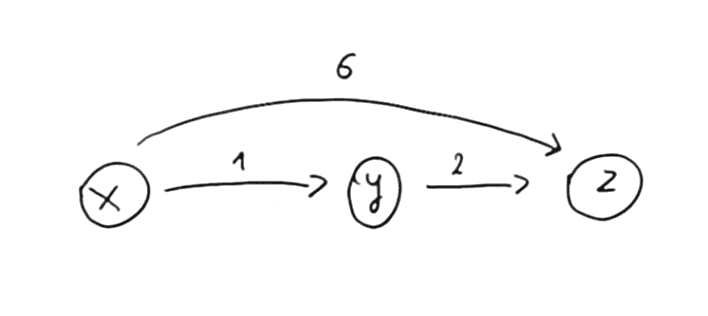

<style>
{
  font-size: 32px;
  padding: 1rem 1.5rem;
}
</style>

# Algorytm Bellmana-Forda

#### Szukanie najkrótszej ścieżki w grafie ważonym

Maciej Luciński, Szymon Kaszuba-Gałka

---

# Twierdzenie (Poprawność algorytmu Bellmana-Forda)

Niech $G=(V,E)$ będzie ważonym grafem kierowanym ze źródłem $s$ i funkcją wagową $w: E \rightarrow R$.

Załóżmy, że algorytm Bellmana-Forda został wykonany dla grafu $G$.

Jeśli graf $G$ nie ma cykli o ujemnych wagach osiągalnych ze źródła $s$, to algorytm zwraca wartość **_TRUE_**, $d[v] = \delta(s, v)$ dla każdego wierzchołka
$v \in V$ i graf poprzedników, który jest drzewem najkrótszych ścieżek o korzeniu w $s$. Jeśli natomiast graf ma cykl o ujemnej wadze osiągalny z $s$, to algorytm zwraca **_FALSE_**.

---

# Algorytm Bellmana-Forda

Służy do rozwiązywania problemu najkrótszych ścieżek z jednego źródła w grafie w którym wagi krawędzi mogą być ujemne.

Korzysta z niego Routing Information Protocol (RIP) służący do obliczania najlepszej ścieżki do celu.

---

# Ujemne cykle

Dla danego skierowanego grafu ważonego

$$
G = (V, E)
$$

Ze źródłem $s$ i funkcją wagową

$$
w: E \rightarrow R
$$

algorytm Bellmana-Forda zwróci wartość logiczną wskazującą czy istnieje cykl o ujemnej wadze osiągany ze źródła.

Jeśli taki cykl istnieje, wówczas dla grafu $G$ Nie można obliczyć najkrótszych ścieżek.

---

# Metoda relaksacji

Algorytm Bellmana-Forda opiera sie na idei Metody Relaksacji (podobnie jak algorytm Djikstry) czyli na sprawdzeniu czy przy przejściu daną krawędzią grafu nie otrzymamy ścieżki krótszej niż dotychczasowa ścieżka.

Jeżeli tak to zmieniamy oszacowanie wagi najkrótszej ścieżki na aktualne oszacowanie.

---

# Przykład użycia Metody Relaksacji

Obliczona droga z $x$ do $z$ jest kosztu $6$. Natomiast następna obliczona droga przez wierzchołek $y$ jest kosztu $3$. Zatem dla wierzchołka $x$ najkrótsza droga $d[z] = 6$ zostanie nadpisana do $d[z] = 3$

<style>
img[alt~="center"] {
  display: block;
  margin: 0 auto;
}
</style>



---

# Złożoność czasowa i pamięciowa algorytmu Bellman'a-Ford'a

Dla wartości $V$ oznaczającej zbiór wierzchołków oraz $E$ oznaczającej zbiór krawędzi dla grafu $G$:

- złożoność czasowa wynosi $O(|V| \cdot |E|)$
- złożoność pamięciowa wynosi $O(|V|)$

---

# Pseudokod

<style scoped>
pre {
   background-color: rgb(25, 25, 25);
   border-radius: 0.5rem;
   padding: 0.25rem;
}
</style>

```python
def bellman_ford(src):
    # 1. Nadaj kazdemu z wierzchołków inf jako odległośc od żródła i przypisz żródłu odległość od niego samego == 0
    distances = [float("Inf")] * vertices_num
    distances[src] = 0

    # 2.0. Przejdź każdy wierzchołek (bez wierzchołka żródła) - złożoność obliczeniowa O(|V|*|E|)
    for _ in range(vertices_num - 1):
        # 2.1. Przejdź każdą krawędź gdzie source to w. początkowy, target to w. końcowy a cost to waga
        for source, target, cost in graph:
            # 2.2. Jeżeli waga dla w. początkowego jest już obliczona i waga drogi dla w. początkowego + waga aktualnej
            # krawędzi jest mniejsza od aktualnej wagi drogi dla w. końcowego (skorzystanie z Metody Relaksacji)
            if distances[source] != float("Inf") and distances[source] + cost < distances[target]:
                # 2.3. To zapisz wage drogi dla w. początkowego + waga aktualnej krawędzi jako
                # nową wagę drogi dla w. końcowego
                distances[target] = distances[source] + cost

    # 3.0. Dla każdej krawędzi grafu sprawdź czy nie istnieje ujemny cykl - złożoność obliczeniowa O(|E|)
    for source, target, cost in graph:
        # 3.1. Jeżeli droga dla danego w. początkowego jest różna od inf i waga drogi dla w. początkowego + waga
        # aktualnej krawędzi jest mniejsza od aktualnej wagi drogi dla w. końcowego
        if distances[source] != float("Inf") and distances[source] + cost < distances[target]:
            # 3.2. Powiadom że graf posiada cykl ujemny
            print("Graph contains negative weight cycle")
            return
```

---

# Źródła

- [Bellman–Ford algorithm - Wikipedia](https://en.wikipedia.org/wiki/Bellman%E2%80%93Ford_algorithm)
- [Bellman Ford Algorithm - Favtutor](https://favtutor.com/blogs/bellman-ford-python)
- Cormen - wprowadzenie do algorytmów
